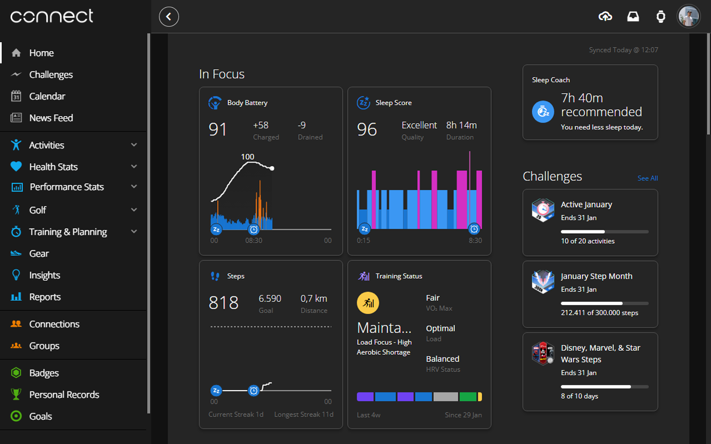

<div align="center">


<a href="https://github.com/kpulka247/dark-connect/actions" title="GitHub Actions Workflow Status"></a>
<a title="Chrome Web Store Size"></a>
<a href="https://github.com/kpulka247/dark-connect/releases" title="GitHub Release"></a>
<a href="https://github.com/kpulka247/dark-connect/blob/main/LICENSE" title="GitHub License"></a>

<a href="https://chromewebstore.google.com/detail/dark-connect/nadhhgppikppmjacnkebagbgcibnfnob" title="Chrome Web Store Users"></a>
<a href="https://chromewebstore.google.com/detail/dark-connect/nadhhgppikppmjacnkebagbgcibnfnob" title="Chrome Web Store Rating"></a>
 &nbsp;&nbsp;&nbsp;&nbsp;&nbsp;&nbsp;
<a href="https://addons.mozilla.org/pl/firefox/addon/dark-connect/" title="Mozilla Add-on Users"></a>
<a href="https://addons.mozilla.org/pl/firefox/addon/dark-connect/" title="Mozilla Add-on Rating"></a>

</div>

## Overview

This is a simple browser extension designed to turn the Garmin Connect website into dark mode. Frustrated by the lack of a dark mode feature on Garmin Connect, I created this extension to enhance the browsing experience for users who prefer a darker interface, especially during nighttime use. The extension is lightweight, easy to install, and only affects Garmin Connect domains, leaving all other websites untouched.

## Features

- 🌙 **Dark Mode for Garmin Connect** — Applies a clean, modern dark theme.
- 🎨 **Preserves brand identity** — Original Garmin colors and charts remain intact for visual consistency.
- 🚫 **Scope-limited** — Affects only `connect.garmin.com`, `livetrack.garmin.com`, and `live.garmin.com`.
- ⚡ **Automatic updates** — New versions are published directly via GitHub Actions to Chrome Web Store and Firefox Add-ons.
- 🛠️ **Modular and maintainable styles** — Powered by organized CSS modules with support for variables.

## Screenshots

Here are some screenshots of the extension in action:




## Installation

<div align="center">

<a href="https://chromewebstore.google.com/detail/dark-connect/nadhhgppikppmjacnkebagbgcibnfnob" title="Chrome Web Store Version"></a>
<a href="https://addons.mozilla.org/pl/firefox/addon/dark-connect/" title="Mozilla Add-on Version"></a>

</div>

To install the extension, click on your browser store and then add the extension to your browser. For 🦁 Brave, 🔴 Opera or 🌀 Microsoft Edge select Chrome Web Store.

## Usage

Once installed, the extension will immediately apply dark mode to any visit to Garmin Connect website. You don’t need to enable or disable it manually — it works automatically whenever you visit the site. If you have suggestions for improvements or have found any bugs, feel free to report them through the issues form.

## Development & Build

This project uses Node.js for its build system and leverages Conventional Commits with `semantic-release` for automated versioning, packaging and publishing.

### 🚀 Getting started

Make sure you have:

- [Node.js](https://nodejs.org) (LTS version recommended) installed on your system
- [Git](https://git-scm.com/) for version control

Then install dependencies:

```bash
npm install
```
### 🔧 How to build the extension

The extension is built using Webpack, managed via npm scripts:

```bash
# Build both Chrome and Firefox versions for production (minified, no source maps, with ZIPs)
npm run build

# Build both Chrome and Firefox versions for development (unminified, with source maps, no ZIPs)
npm run dev
```

- Generates browser-specific unpacked builds in the `dist/darkconnect-chrome/` and `dist/darkconnect-firefox/` directories.
- Processes css:
    - Resolves `@import` statements (via `css-loader`).
    - Minifies CSS in production mode (via `css-minimizer-webpack-plugin`).
    - Extracts CSS into a single `styles/main.css` file for each browser build.
- Copies necessary files like `manifest.json` (browser-specific), `background.js`, and icons.
- In production mode (`npm run build`), packs the builds into `.zip` files located in the `dist/` directory (e.g., `dist/darkconnect-2.1.0-chrome.zip`, `dist/darkconnect-2.1.0-firefox.zip`).

### 🧪 Local testing (e.g. in Chrome)

To test the extension locally in a browser:

1. Run `npm run dev` - this will build the extension and watch for file changes
2. Open Chrome and navigate to `chrome://extensions`
3. Enable "Developer mode" (usually a toggle in the top-right corner)
4. Click "Load unpacked"
5. Select the `dist/darkconnect-chrome/` folder generated in step 1
6. The extension will now appear in your list and function on the relevant Garmin pages

### 🏷️ Versioning and Releases (Automated)

This project uses [semantic-release](https://github.com/semantic-release/semantic-release) and [Conventional Commits](https://www.conventionalcommits.org/) for automated version management and release publishing.

- **How it works:** When commits following the Conventional Commits specification (e.g., `feat: ...`, `fix: ...`, `perf: ...`, commits with `BREAKING CHANGE: ...`) are merged into the `main` branch, a GitHub Actions workflow automatically:

    1. Analyzes the commits since the last release
    2. Determines the next semantic version number (patch, minor, or major)
    3. Updates the `version` in `package.json` and `manifest.*.json` files
    4. Generates/updates the `CHANGELOG.md` file
    5. Commits these updated files
    6. Creates a Git tag for the new version (e.g., `v2.1.0`)
    7. Creates a GitHub Release with changelog notes and attaches .zip assets
    8. Publishes the new Chrome build directly to the Chrome Web Store
    9. Publishes the new Firefox build directly to Mozilla Add-ons (AMO) via automated signing/upload
- **Developers generally do not need to manually bump versions** using `npm version` for standard releases. The automation handles it based on commit messages.

## Development Notes

### 🗂️ Manifests

- `manifest.chrome.json` / `manifest.firefox.json`: These are the source manifest files located in the root of the project.
    - They are updated with the correct version number by `semantic-release` during the release process.
    - The Webpack build process copies the appropriate source manifest (e.g., `manifest.chrome.json`) to `dist/darkconnect-chrome/manifest.json` for each build.
    - These manifests should reference the single, compiled `styles/main.css` and `background.js`.

### 🧰 Tools & Scripts

- `webpack.config.js`: Configures the Webpack build process, handling CSS compilation, minification, file copying, and ZIP packaging.
- `scripts/update-manifest-version.js`: Replaces placeholders in manifests with the current version.
- `.releaserc.json`: Configures `semantic-release` pipeline.
- `release.yml`: GitHub Actions workflow to run the release pipeline automatically.

## Changelog

Changes for each release are automatically documented in the [CHANGELOG.md](./CHANGELOG.md) file.