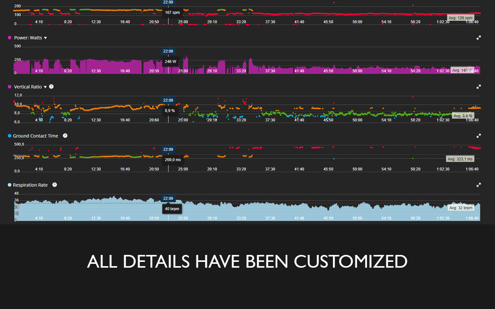
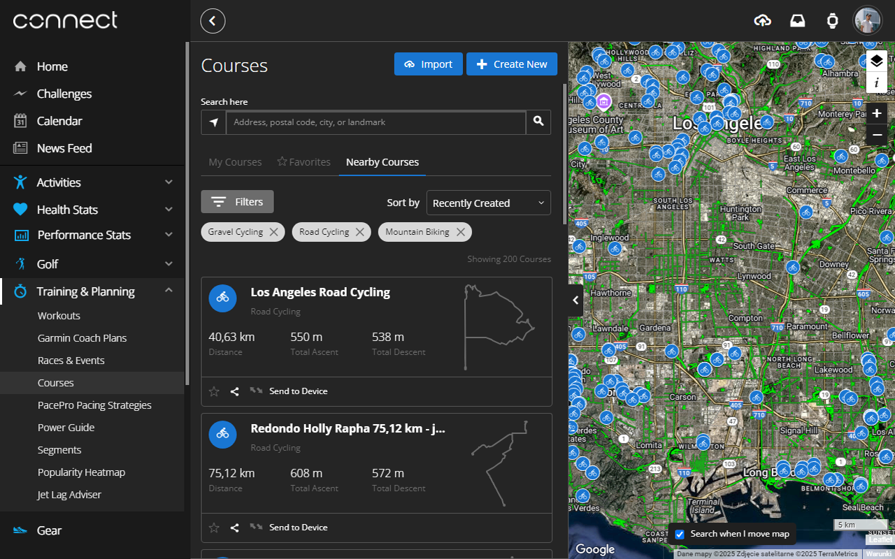

# Dark Connect

## Overview

This is a simple browser extension designed to turn the Garmin Connect website into dark mode. Frustrated by the lack of a dark mode feature on Garmin Connect, I created this extension to enhance the browsing experience for users who prefer a darker interface, especially during nighttime use. The extension is lightweight, easy to install, and only affects the Garmin Connect page, leaving all other websites untouched.

## Features

- **Dark mode for Garmin Connect**: Instantly changes the theme of the Garmin Connect website to dark mode.
- **Preserved brand colors**: Retains the original colors of key elements, such as charts and recognizable brand features, while switching the background and other components to dark mode.
- **No impact on other websites**: The extension only affects `connect.garmin.com`, other pages remain unaffected.

## Screenshots

Here are some screenshots of the extension in action:

## Installation

### Chrome, Edge, Brave, Opera, Firefox

To install the extension, follow these simple steps:

1. **Download the extension** from your browser's extension store:
    - [**Chrome Web Store**](https://chromewebstore.google.com/detail/nadhhgppikppmjacnkebagbgcibnfnob) (Google Chrome 🌐, Brave 🦁, Opera 🔴, Microsoft Edge 🌀)
    - [**Mozilla Firefox**](https://addons.mozilla.org/en-US/firefox/addon/dark-connect/) 🦊
    - [**Microsoft Edge Add-ons**](https://microsoftedge.microsoft.com/addons/detail/dark-connect/hnckjkhlhafbecddeacdgnjogokoejhm) 🌀

2. **Add the extension to your browser**: Once added, the extension will automatically turn your Garmin Connect page into dark mode.

3. **That's it!** No further configuration is required. Just browse Garmin Connect website in dark mode.

## Usage

Once installed, the extension will immediately apply dark mode to any visit to `connect.garmin.com`. You don’t need to enable or disable it manually — it works automatically whenever you visit the site. If you have suggestions for improvements or have found any bugs, feel free to report them through the issues form.